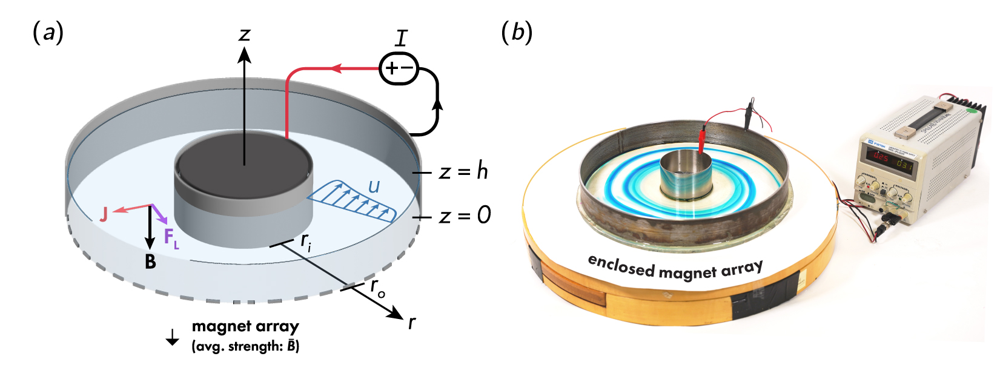
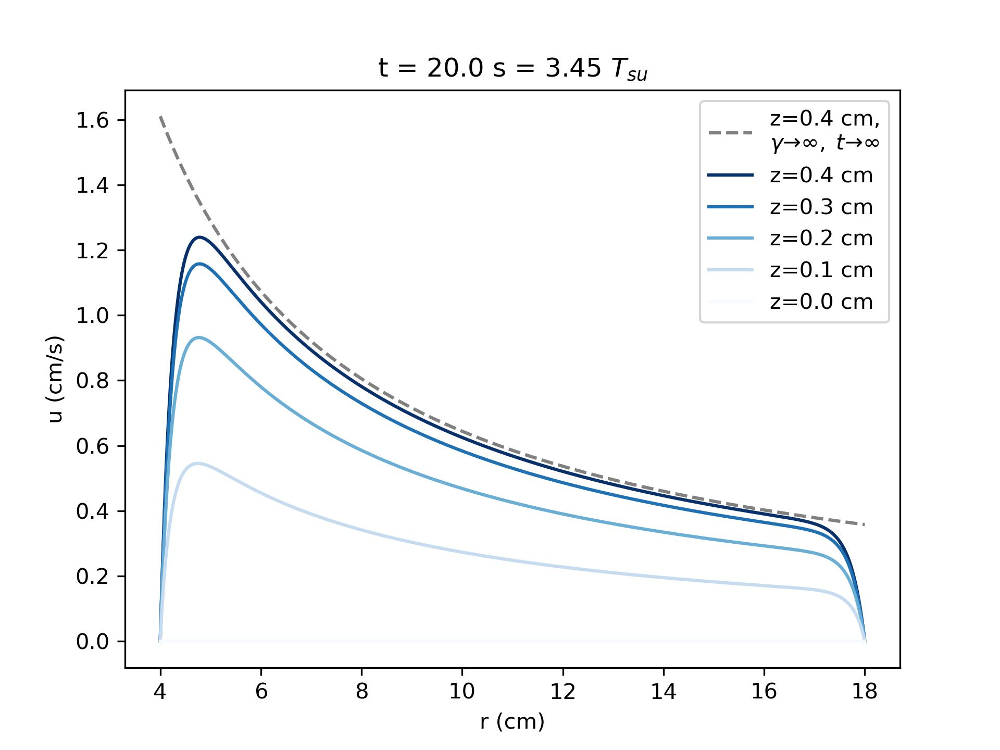
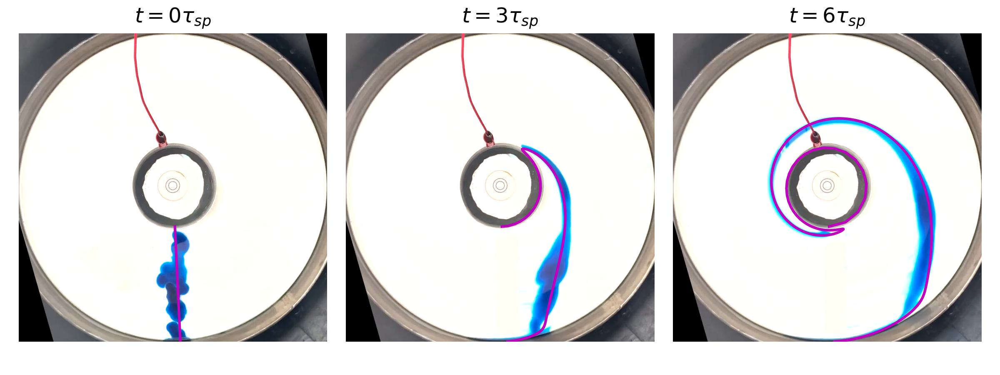

# magStokesSoln

This package implements the theoretical predictions for magnetohydrodynamically-pumped flow in a shallow free surface annulus as formulated in [1].
 
Consider a layer of conducting fluid of depth $h$ in the annular gap between two cylindrical electrodes of radius $r_i$ and $r_o$ ($r_i < r_o$). A current $I$ runs through the fluid from inner to outer electrode, and the entire annulus is immersed in a vertical, imposed magnetic field ${B_0} =  -B_0 {e_z}.$ Figure 1(a) shows a schematic of the annular channel with imposed magnetic field and current. Figure 1(b) shows the actual laboratory device with a spiral of blue dye that reveals the swirling flow.

When the power supply is turned on, the fluid experiences an azimuthal electromagnetic force that drives circulatory flow against viscous drag.

The dimensionless axisymmetric solution for spin-up from rest may be approximated as 

${u}^*_\theta(\tilde{r},\tilde{z},\tilde{t}) = (\sum _{n=1} \frac{2(\chi+1)}{k_n^2 \gamma}[ \frac{\gamma}{k_n \tilde{r}}-A_n I_1( \frac{k_n}{ \gamma}\tilde{r}) - B_n K_1( \frac{k_n}{ \gamma}\tilde{r}) ]\sin (k_n  \tilde{z}) )\times [1- \exp(-\frac{\pi ^2}{4 {Re}_C}\tilde{t})]$

where

$A_n=\frac{\gamma}{k_n \chi}\left[\frac{\chi  K_1\left({k_n \chi}/{\gamma }\right)-K_1\left({k_n }/{\gamma}\right)}{I_1\left({k_n}/{\gamma}\right) K_1\left({k_n\chi}/{\gamma}\right)-K_1\left({k_n}/{\gamma}\right) I_1\left({k_n \chi }/{\gamma}\right)}\right]$,

$B_n=\frac{I_1\left({k_n}/{\gamma}\right)-\chi  I_1\left({k_n\chi }/{\gamma}\right)}{\chi  K_1\left({k_n \chi}/{\gamma }\right)-K_1\left({k_n}/{\gamma}\right)} A_n$,  

$k_n=\pi (n-1/2)$,  $Re_C = (h^2/\nu)/((r_i+r_o)/\mathcal{U}_\text{MS})$, $\chi = r_i/r_o$, and $\gamma = h/r_o$,

with dimensionless coordinates

$\tilde{r} = r/r_o$,    $\tilde{z}=z/h$,   $t=\tilde{t}(r_i+r_o)/\mathcal{U}_\text{MS}$,  

and velocity scale

$\mathcal{U}_\text{MS} =B_0 h I/(2 \pi  \nu  \rho (r_i+r_o))$.

Given laboratory parameters, this package implements the solution above. For example, consider a saltwater (80 ppt NaCl:H2O) flow with
- 0.4 cm fluid layer depth, $h$
- 4 cm inner cylinder radius, $r_i$
- 18 cm outer cylinder radius, $r_o$
- 0.03 Tesla (300 Gauss) magnetic field strength, $B_0$
- 0.08 A applied current, $I$

The example notebook (example.ipynb) demonstrates how to make the following plot of predicted velocity at time t after the power supply is turned on:

This code can also be used to compare lab data to theoretical predictions. The example notebook demonstrates how to make the following figure of theory (magenta) plotted over videoframes of a dye streak experiment:

[1] C.S. David, E.W. Hester, Y. Xu, J.M. Aurnou.
    Magneto-Stokes Flow in a Shallow Free-Surface Annulus. In prep.
